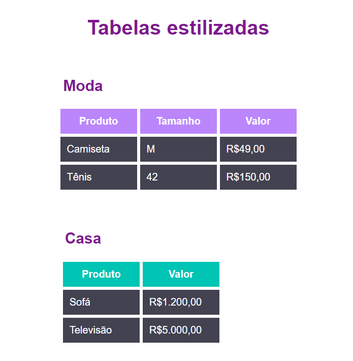

# Desafio 4 - HTML e CSS básicos ❗

## Tabelas 

Nesse desafio foi necessário fazer duas tabelas simples com HTML e CSS, tendo o objetivo de praticar o uso das tags, classes e aplicar a sintaxe correta das linguagens.
 
## Resultado ✔

